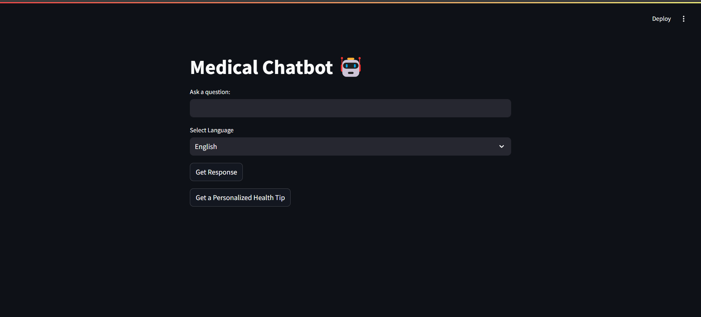
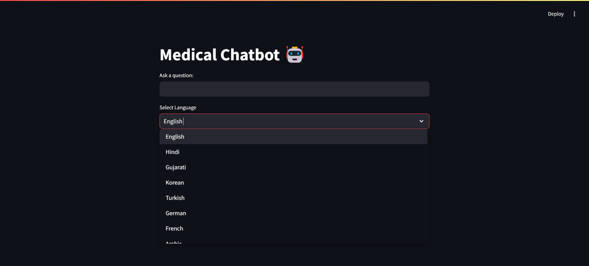
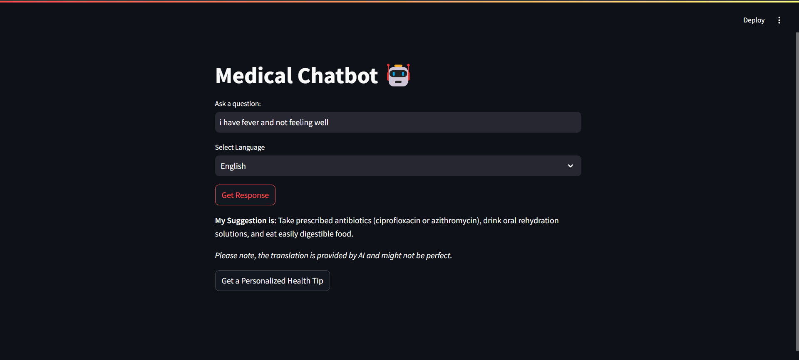
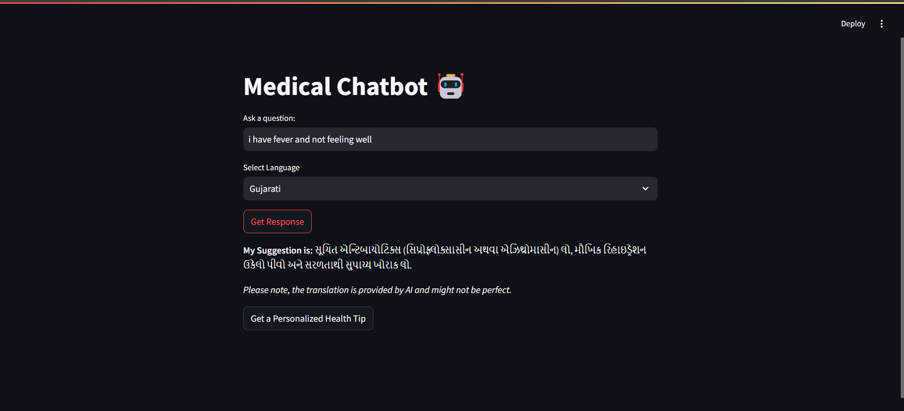
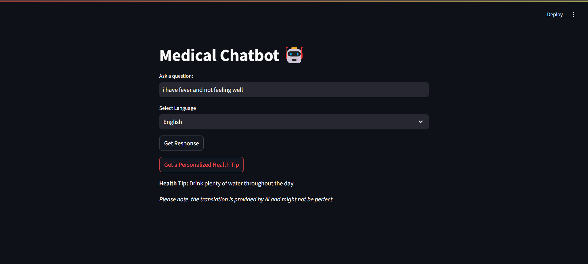
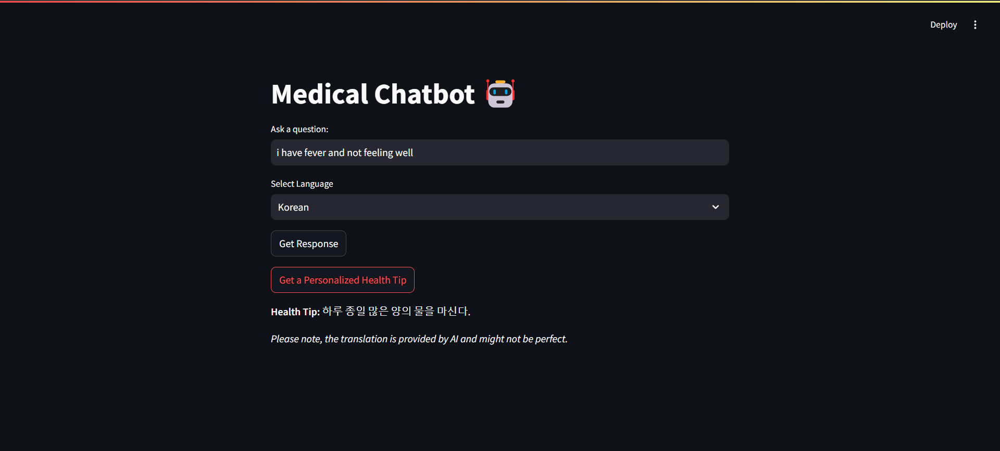

# AI-Health-Assistant 🏥

AI-powered Medical Chatbot that provides comprehensive health advice, detailed disease-symptom analysis, and multilingual support using advanced NLP and machine learning. Get personalized recommendations and detailed health information in your preferred language.

## 🚀 Key Features

### ✨ Enhanced Features

**📋 Detailed Medical Responses:**
- Comprehensive, detailed answers with step-by-step guidance
- Includes treatment options, prevention tips, and when to seek medical attention
- Enhanced medical knowledge base with 500+ medical scenarios

**🔊 Text-to-Speech (TTS) Support:**
- Click the 🔊 voice icon to listen to responses
- Supports all selected languages (English, Hindi, Kannada, Telugu)
- Perfect for accessibility and hands-free information access

**🌍 Multilingual Support (4 Languages):**
- **English** - For global users
- **Hindi (हिंदी)** - For Hindi-speaking users
- **Kannada (ಕನ್ನಡ)** - For Kannada-speaking users  
- **Telugu (తెలుగు)** - For Telugu-speaking users
- All responses are automatically translated to your selected language

**💡 Personalized Health Tips:**
- Tailored advice based on your symptoms and queries
- Comprehensive guides covering sleep, energy, stress management, and general wellness
- Detailed explanations with actionable steps

**🎯 Disease-Symptom-Cure Analysis:**
- Leverages an extensive medical dataset (500+ conditions)
- Uses advanced semantic similarity matching
- Provides accurate analysis of symptoms, potential diseases, and recommended remedies

**🎨 Modern User Interface:**
- Beautiful, responsive design with custom styling
- Sidebar navigation for easy access to settings
- Clear, organized response display
- User-friendly layout optimized for all devices

## 🛠️ Technologies Used

**Natural Language Processing (NLP):**
- Sentence Transformers (`all-MiniLM-L6-v2`) for semantic similarity matching
- Advanced embedding models for accurate disease-symptom matching

**Machine Learning:**
- PyTorch for tensor operations and model inference
- Sentence Transformers library for efficient similarity calculations
- Cosine similarity for matching user queries with medical conditions

**Text-to-Speech:**
- Google Text-to-Speech (gTTS) for voice output
- Supports multiple languages with natural voice synthesis

**Translation:**
- Google Translate API for multilingual support
- Real-time translation of medical responses

**Web Framework:**
- Streamlit for building an intuitive, interactive web interface
- Custom CSS for enhanced UI/UX

**Data Processing:**
- Pandas for dataset management
- CSV-based medical knowledge base with 500+ scenarios

## 📸 Screenshots

### Main Screen
  
*The main interface of the Medical Chatbot.*

### Language Dropdown
  
*Dropdown menu showing supported languages.*

### Suggestions in English
  
*Example of health suggestions provided in English.*

### Suggestions in Gujarati
  
*Example of health suggestions provided in Gujarati.*

### Health Tip in English
  
*Example of a health tip provided in English.*

### Health Tip in Korean
  
*Example of a health tip provided in Korean.*

## 🌍 Multilingual Support

Our chatbot supports **4 languages** to ensure accessibility for users across India:

- **English** - Universal language support
- **Hindi (हिंदी)** - For Hindi-speaking regions
- **Kannada (ಕನ್ನಡ)** - For Karnataka region
- **Telugu (తెలుగు)** - For Telangana and Andhra Pradesh regions

Simply select your preferred language from the sidebar, and all responses will be automatically translated. You can also listen to responses using the 🔊 text-to-speech feature!

## 📊 Dataset

The chatbot uses a comprehensive medical dataset containing **500+ medical conditions** with:
- Disease names and symptoms
- Detailed treatment recommendations
- Prevention strategies
- When to seek medical attention

The dataset covers:
- Common illnesses (colds, flu, infections)
- Chronic conditions (diabetes, hypertension, heart disease)
- Mental health conditions
- Skin conditions
- Neurological disorders
- And many more...

## ⚠️ Medical Disclaimer

**IMPORTANT:** This chatbot provides general health information for educational purposes only. It is **NOT** a substitute for professional medical advice, diagnosis, or treatment. 

- Always consult qualified healthcare professionals for medical concerns
- Seek immediate emergency care for severe symptoms
- Do not delay seeking professional medical advice
- The information provided may not be complete or applicable to your specific situation

## 🙏 Acknowledgments

- **Sentence Transformers**: For semantic similarity matching
- **Hugging Face**: For the Transformers library and model hosting
- **Streamlit**: For the easy-to-use web framework
- **Google Translate API**: For enabling multilingual support and translations
- **Google Text-to-Speech (gTTS)**: For voice output functionality
- **Medical Community**: For the comprehensive medical knowledge base


## 🛠️ Installation & Setup

### Prerequisites
- Python 3.8 or higher
- pip package manager

### Installation Steps

1. **Clone the repository:**
   ```bash
   git clone https://github.com/adibshaikh0313/AI-Health-Assistant.git
   cd AI-Health-Assistant-main
   ```

2. **Install required dependencies:**
   ```bash
   pip install -r requirement.txt
   ```

3. **Run the application:**
   ```bash
   streamlit run chat.py
   ```

4. **Access the application:**
   - The app will automatically open in your default web browser
   - Default URL: `http://localhost:8501`

### 📦 Required Packages
- `streamlit` - Web framework
- `pandas` - Data processing
- `sentence-transformers` - NLP model
- `googletrans` - Translation service
- `gtts` - Text-to-speech
- `torch` - PyTorch for ML operations
- `transformers` - Hugging Face transformers
- `numpy` - Numerical operations

### ⚠️ Important Notes
- Internet connection required for translation and TTS services
- First run may take time to download the ML model
- Ensure the `dataset - Sheet1.csv` file is in the same directory as `chat.py`

👨‍💻 **Adibmiya Shaikh**: Lead Developer


📜 License
MIT License

Copyright (c) 2025 

Permission is hereby granted, free of charge, to any person obtaining a copy of this software and associated documentation files (the "Software"), to deal in the Software without restriction, including without 
limitation the rights to use, copy, modify, merge, publish, distribute, sublicense, and/or sell copies of the Software, and to permit persons to whom the Software is furnished to do so, subject to the following 

conditions:

The above copyright notice and this permission notice shall be included in all copies or substantial portions of the Software.

THE SOFTWARE IS PROVIDED "AS IS", WITHOUT WARRANTY OF ANY KIND, EXPRESS OR IMPLIED, INCLUDING BUT NOT LIMITED TO THE WARRANTIES OF MERCHANTABILITY, FITNESS FOR A PARTICULAR PURPOSE AND NONINFRINGEMENT. IN NO 
EVENT SHALL THE AUTHORS OR COPYRIGHT HOLDERS BE LIABLE FOR ANY CLAIM, DAMAGES OR OTHER LIABILITY, WHETHER IN AN ACTION OF CONTRACT, TORT OR OTHERWISE, ARISING FROM, OUT OF OR IN CONNECTION WITH THE SOFTWARE OR 
THE USE OR OTHER DEALINGS IN THE SOFTWARE.

